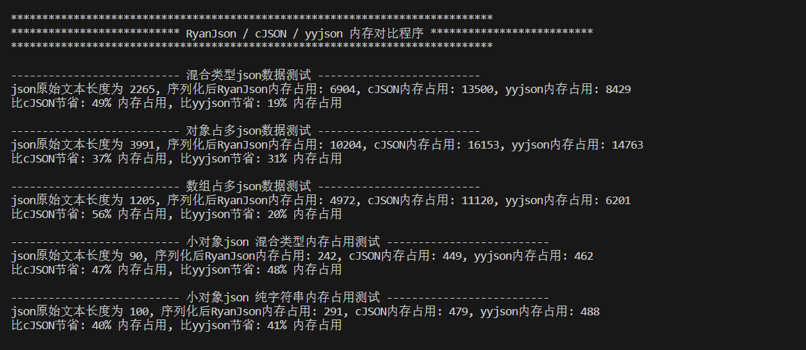
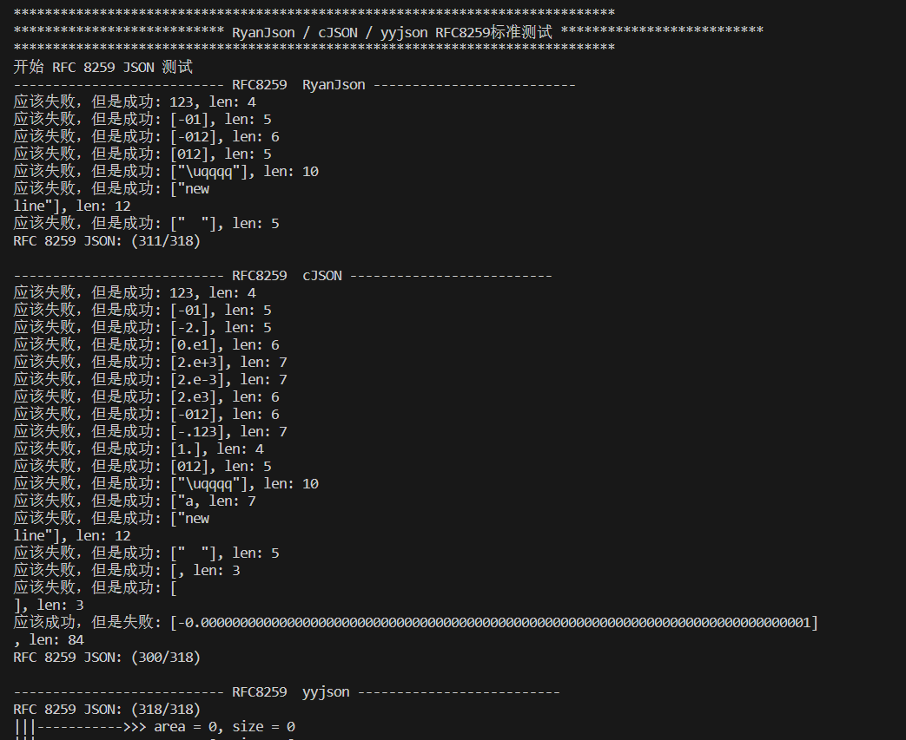

# 性能测试

### 内存测试

测试代码可在本项目根目录查看。

#### 内存占用测试

#### RFC 8295 标准测试，大部分嵌入式场景不会出现复杂的特殊json结构

**_RyanJson和cJSON都不适合处理复杂的UTF-16字符集，如果项目需要兼容Unicode字符集，可以考虑yyjson / json-c_**

### **效率测试**

使用 yyjson_benchmark 进行测试，结果如下。

点击图表右侧 tip 可以隐藏 / 显示当前测试结果

 
    <iframe style="position: absolute; width: 100%; height: 100%; left: 0; top: 0;" 				src="https://ryan-cw-code.github.io/RyanDocs/report.html" frameborder="1"</iframe> 

